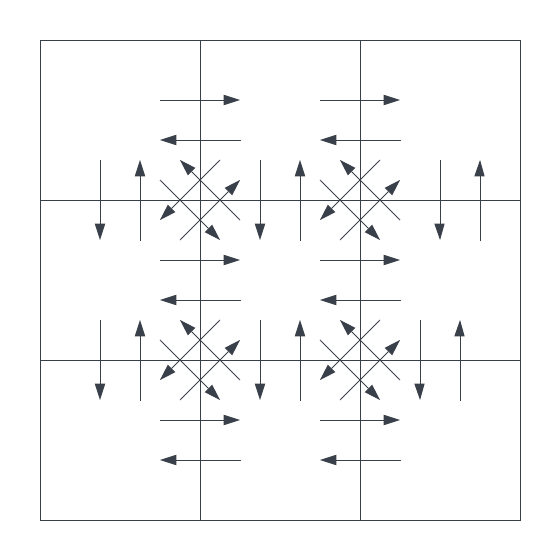
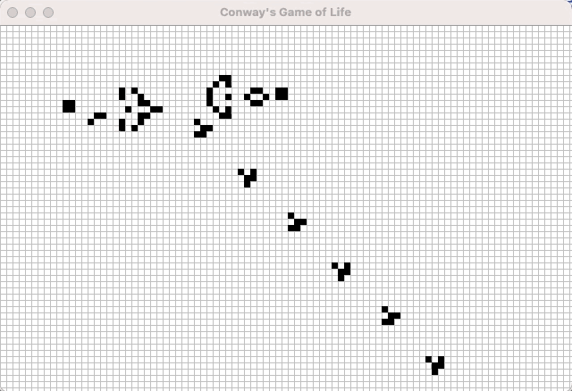
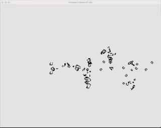

## Game of Life CSP

Game of Life CSP is a Java implementation of [Conway's Game of Life](https://en.wikipedia.org/wiki/Conway%27s_Game_of_Life)
using [communicating sequential processes (CSP)](https://en.wikipedia.org/wiki/Communicating_sequential_processes). 

Each grid cell is an independent process and all cell communication occurs via channels.

It's built atop virtual threads, defined in [JDK Enhancement Proposal (JEP) 425](https://openjdk.java.net/jeps/425).

The virtual threads feature is part of [Project Loom](https://openjdk.java.net/projects/loom/).

Prior to Project Loom and virtual threads, CSP style programming in this manner simply wasn't available in Java.



# Build

A [Project Loom](https://jdk.java.net/loom/) or [OpenJDK 19](https://jdk.java.net/19/) early access build is required at the time of writing.

---
Build with `mvn`:
```
mvn compile
```

Run:
```
java --enable-preview -cp target/classes/ gameoflife.Main
```

---
Compile with `javac`:
```
javac --enable-preview -source 19 src/main/java/gameoflife/*.java -d build/
```

Run:
```
java --enable-preview -cp build/ gameoflife.Main
```

---


## Command Line Arguments

Command line arguments are optional.

```
java --enable-preview -cp target/classes/ gameoflife.Main patterns/spaceship.txt 1800 1200 20 50 50 5 5 false true
```

1. Pattern text file, ex. `patterns/spaceship.txt`
2. Maximum window width, ex. `1800`
3. Maximum window height, ex. `1200`
4. Game of Life simulation period milliseconds, ex. `25`
5. Left padding columns, ex. `50`
6. Top padding rows, ex. `50`
7. Right padding columns, ex. `5`
8. Bottom padding rows, ex. `5`
9. Rotate boolean flag, ex. `false`
10. Log rate boolean flag, ex. `true`

## Patterns

The [patterns](patterns) directory contains text-encoded patters taken from 
Life Lexicon located at: https://people.sc.fsu.edu/~jburkardt/m_src/exm/lexicon.txt

The lexicon is copyright (C) Stephen Silver, 1997-2005.

The full list of contributors can be found under the credits section of the website.

## Processes

Every cell runs in its own process, defined in [Cell.java](src/main/java/gameoflife/Cell.java). 
Cell processes communicate with each other via channels.

The simulation runs in its own process, defined in [GameOfLife.java](src/main/java/gameoflife/GameOfLife.java).

Finally, the viewer runs in its own process, defined in [Main.java](src/main/java/gameoflife/Main.java).

* Cell processes: `R * C`
* Simulation processes: `1`
* Viewer processes: `1`
* Total processes: `R * C + 2`

## Channels

A pair of channels, one in each direction, exists for every pair of neighbor cells.

* Vertical segments: `(C - 1) * R` 
* Horizontal segments: `(R - 1) * C` 
* Interior vertices: `(R - 1) * (C - 1)`
* Total cell-to-cell channels: `[2 * (C - 1) * R] + [2 * (R - 1) * C] + [4 * (R - 1) * (C - 1)]`

Additionally, each cell has a channel for receiving a tick event and
and a channel for emitting results after each simulation tick.

* Tick channels: `R * C`
* Result channels: `R * C`

Finally, a channel is used to communicate a full liveness matrix to
the main application consumer.

* Total channels: `2 * (C - 1) * R + 2 * (R - 1) * C + 4 * (R - 1) * (C - 1) + R * C * 2 + 1`

## Benchmark

The following command results in a grid of 50,000 cells (250 x 200):

That results in `50,002` virtual threads and `497,305` channels.

```
java --enable-preview -cp target/classes/ gameoflife.Main patterns/puffer_train.txt 1600 800 0 235 91 10 91 true true
```

It's a demonstration of the viability of virtual threads in a highly concurrent, computationally intensive application.

